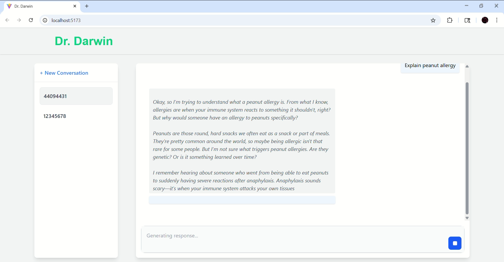

# Dr. Darwin

An AI medical diagnostic specialist with memory and persistent storage.

## Important

This project is for learning only, please do not use it in production environment.

## Requirements

- At least 8GB GPU memory, 12GB is recommended
- Node v18+
- npm 8.x+
- JDK 17+
- Maven (recommend)
- Ollama
- MongoDB

## AI model

This project uses **ollama** as the model provider and **deepseek-r1:7b** model. Please go to [ollama.com](https://ollama.com/) to complete the installation.

## Get start

1. Under `/db` folder, run the following to initialize the database. This will create and initialize a database `doctordarwin`.
```bash
npm .\inits.js
```
2. Install all the frontend and backend dependencies. 
3. For the backend, run the application. For the frontend, run `npm run dev`.

## Sample video
[](https://youtu.be/F0knHBycgpc)
